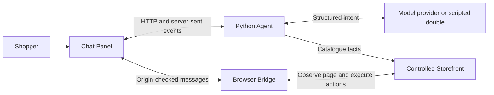

# Shopping Copilot

[](https://github.com/Homd11/shopping-copilot/actions/workflows/ci.yml)

**An Arabic-first shopping assistant that turns everyday requests into visible, controlled browser actions.**

Shopping Copilot helps a shopper find products, navigate a store, and manage a cart
using Egyptian Arabic, English, Franco-Arabic, or mixed-language requests. The
engineering focus is the full interaction: interpreting a request, grounding it in
store facts, checking each action, and giving the shopper clear control over changes.

This is a **graduation-project MVP under development**, built around one local
Controlled Storefront. It is a working test environment for the assistant, with
fictional products, accounts, orders, and checkout. Compatibility with independent
retailers and production readiness have not been demonstrated.

## What works today

| Capability              | Current behavior                                                                                                                     |
| ----------------------- | ------------------------------------------------------------------------------------------------------------------------------------ |
| Multilingual discovery  | Understands supported product, price, size, color, availability, and sorting requests; asks for missing information.                 |
| Grounded suggestions    | Uses the controlled catalogue to distinguish exact matches from alternatives and styling suggestions.                                |
| Navigation and guidance | Opens requested destinations or highlights relevant controls, including cart and order-history flows.                                |
| Cart editing            | Adds selected variants, changes a named item's quantity, and removes individual lines. Manual storefront controls are available too. |
| Ten-second Undo         | Restores the exact prior cart after reversible edits. Rapid changes to one line share the original Undo state and deadline.          |
| Guarded changes         | Explicit bulk cart clearing and fictional checkout submission require a visible, action-specific confirmation.                       |
| Refresh recovery        | Restores conversation and pending questions, reconciles the current page, and preserves only the remaining Undo time.                |
| Stop and tab ownership  | Cancels active work and requires explicit takeover before another tab can execute actions.                                           |
| Mobile interaction      | Offers mobile menu and filters, custom sorting, size swatches, mini-cart status, delayed product loading, and reachable Stop.        |
| Optional speech input   | Transcribes Egyptian Arabic or English into editable text when the browser supports recognition; sending remains explicit.           |

Examples of supported requests:

| Request                                     | Intended task                                                          |
| ------------------------------------------- | ---------------------------------------------------------------------- |
| `عاوز كوتشي للجري بأقل من ٢٠٠٠`             | Find running shoes below EGP 2,000.                                    |
| `3ayez kootshi running ta7t 2,000 EGP`      | Express the same request in Franco-Arabic.                             |
| `Show unavailable bags newest first`        | Apply availability and sorting constraints.                            |
| `عايزك تضيف اتنين كمان من كوتشي صانع اللعب` | Increase the named cart line by two, leaving other products unchanged. |
| `شيل الحاجة اللي فالسلة كلها`               | Request bulk clearing, then wait for explicit confirmation.            |

These examples describe supported scenarios, not a guarantee for every phrasing.
The default scripted mode exercises deterministic flows; broader natural-language
testing uses an explicitly configured model provider.

## Safety and recovery are part of the interaction

The model interprets intent; its response does not directly authorize a browser action.
Structured outputs pass local schema and semantic checks, and deterministic code
plans and verifies the resulting action.

- **Restricted navigation:** the Bridge blocks off-origin navigation.
- **Sensitive fields:** the Bridge excludes sensitive field values from page
  snapshots and blocks agent interaction with those fields. Fictional payment and
  login details are entered by the shopper.
- **Untrusted page content:** storefront text is treated as data, not instructions
  that can override the shopper's task or action policy.
- **Bound confirmation:** guarded changes use single-use authority tied to the
  task, intended action, and current cart state. It expires after sixty seconds,
  relevant state changes, or refresh.
- **Action identity:** task identifiers, action identifiers, and sequence numbers
  reject stale or duplicate work.
- **Uncertain outcomes:** refresh does not automatically replay an unverified cart
  or checkout mutation. The assistant hands control back instead of guessing.

These safeguards are tested against the controlled environment. They are not a
claim of production security or universal prompt-injection resistance.

## How it works



The Bridge builds a compact semantic Snapshot of the page. The Agent combines the
shopper's request, validated intent, and current state to select one Action at a
time. The Bridge executes it and returns an Action Result with a fresh Snapshot.
The Agent checks the result before advancing or reporting completion.

| Location                       | Responsibility                                                                                             |
| ------------------------------ | ---------------------------------------------------------------------------------------------------------- |
| [`agent/`](agent/)             | Python/FastAPI task execution, intent validation, planning, sessions, confirmation, and provider adapters. |
| [`bridge/`](bridge/)           | TypeScript page observation, action execution, and browser-side safety checks.                             |
| [`panel/`](panel/)             | TypeScript/Vite chat interface, task status, shopper decisions, and recovery coordination.                 |
| [`store/`](store/)             | Node/Express controlled storefront, cart state, Undo, and fictional checkout.                              |
| [`eval/`](eval/)               | Python/Playwright evaluation and browser regression tests.                                                 |
| [`protocol/v1/`](protocol/v1/) | Shared fixtures for the versioned Snapshot, Action, and Action Result contracts.                           |

## Verification and evidence

As of **26 September 2026**, the complete local automated suite passed **521 tests:
144 TypeScript and 377 Python**, including desktop and mobile browser regressions. The
[verified GitHub Actions run](https://github.com/Homd11/shopping-copilot/actions/runs/36162368824)
also passed formatting, lint, build, and HTTP health checks.

Ordinary CI uses the scripted provider and makes no paid model calls. A separate
bounded live evaluation of **Gemini 2.5 Flash through OpenRouter** passed:

- **16/16 intent cases:** eight Egyptian Arabic cart scenarios, each run twice.
- **4/4 browser cases:** add, named quantity change in a mixed cart, individual
  removal, and confirmation-bound bulk clearing. Reversible changes also verified Undo.

The [live evaluation record](docs/superpowers/plans/2026-09-25-openrouter-cart-evaluation.md)
documents the setup and results. This small batch supports those tested scenarios;
it does not establish general language reliability, performance targets, or the
complete MVP acceptance gate.

## Run locally

### Requirements

- Python 3.12
- Node.js 24.13.0
- pnpm 11.19.0 (the version declared in `package.json`)
- Chromium installed through the pinned Playwright package for browser tests
- GNU Make for `make ci`, or the equivalent commands below on Windows

```sh
git clone https://github.com/Homd11/shopping-copilot.git
cd shopping-copilot
```

For a new Windows checkout:

```powershell
py -3.12 -m venv .venv
.\.venv\Scripts\Activate.ps1
python -m pip install -r requirements.lock
pnpm install --frozen-lockfile
Copy-Item .env.example .env
python -m playwright install chromium
```

For a new Linux/macOS checkout:

```sh
python3.12 -m venv .venv
source .venv/bin/activate
python -m pip install -r requirements.lock
pnpm install --frozen-lockfile
cp .env.example .env
python -m playwright install chromium
```

On a Linux CI runner, use `python -m playwright install --with-deps chromium`
to install the browser's system dependencies too. If the pnpm shim is unavailable,
try `corepack pnpm` in place of `pnpm`.

Do not overwrite an existing `.env`. The example selects `scripted` / `scripted-v1`,
so the default setup needs no API key and makes no external model requests.

Start these in three separate terminals from the repository root. Activate the
Python environment in the Agent terminal:

```sh
# Terminal 1: Storefront and Bridge build
pnpm run store

# Terminal 2: Agent
python -m uvicorn agent.app:app --host 127.0.0.1 --port 8000

# Terminal 3: Panel
pnpm run panel
```

Open **http://localhost:4100/**. The Panel embeds the Storefront on port 4000 and
connects to the Agent on port 8000. The Agent health endpoint is
http://localhost:8000/health.

### Optional live-model mode

Adapters exist for OpenRouter, native Gemini, Groq, and NVIDIA NIM. Their presence
does not imply equal evaluation coverage. The recorded cart evaluation used:

```dotenv
LLM_PROVIDER=openrouter
LLM_MODEL=google/gemini-2.5-flash
OPENROUTER_API_KEY=your-local-key
```

Set these only in your ignored `.env` and restart the Agent. The current OpenRouter
adapter requires a **non-resetting key spending limit of at most $0.25** for bounded
evaluation; it checks that allowance before paid calls and does not automatically
retry or switch models. This is a project evaluation guard, not a production
billing system. Never commit real keys or put them in browser code.

### Tests and quality checks

Activate the Python environment. Stop demo services before running the full suite:
browser tests start their own services on ports 4000, 4100, and 8000 and reset
fictional cart fixtures.

```sh
make ci
```

Equivalent checks without GNU Make:

```sh
pnpm format:check
pnpm lint
pnpm test
pnpm build
```

For the standalone browser evaluation runner:

```sh
pnpm eval:browser
```

It reports case outcomes, steps, elapsed time, and failure details. The standalone
runner is a subset of the checks; the full test command also runs the ticket-specific
browser regressions. Live-model evaluations are separate opt-in runs described in
the evaluation record.

## Scope and remaining work

**Implemented through Ticket 13; the local MVP is not yet complete.**

| Stage     | Remaining goal                                                                                                                                    |
| --------- | ------------------------------------------------------------------------------------------------------------------------------------------------- |
| Manual QA | Run the documented [Arabic/English microphone smoke test](docs/ticket13-speech-smoke.md) on a real device.                                        |
| Ticket 14 | SPA navigation, controlled inputs, and event-stream reconnection under the same behavior and safety contract.                                     |
| Ticket 15 | The complete 44-case gate: three recorded runs with at least 40/44 passing per run, every safety case passing, and measured step/latency targets. |
| Ticket 16 | Five-person uncoached usability study, evidence-backed fixes, and published MVP results.                                                          |

The original [MVP plan](MVP_PLAN.md) describes a narrower starting point. Approved
scope subsequently added cart Undo, confirmation, refresh recovery, and tab
ownership to make shopper control testable. Those additions do not imply a move to
a general commerce platform. SPA stress cases, the full evaluation gate,
and the participant study still have to be completed.

Current limits:

- One controlled local storefront and Chromium; independent DOMs and retailers are unproven.
- In-memory cart and session state; browser refresh recovery does not provide durability across service restarts.
- Fictional authentication, orders, and payment; no real transactions or production identity system.
- Local EGP pricing; no currency conversion.
- No Shopify/WooCommerce integration, crawler, Redis, production database, or AWS runtime.
- No completed five-person study or claim that the full MVP acceptance targets have passed.

### Architecture direction

Task coordination is concentrated in `agent/sessions.py`, with substantial intent
validation, planning, and Panel coordination in neighboring modules. File length
is a signal to inspect responsibility and coupling, not an automatic reason to
create more classes.

The recommended refactoring checkpoint is **after the local MVP gate and before
independent-storefront integrations**. Small extractions may happen earlier when
needed to fix a demonstrated defect or implement the active ticket safely.

The proposed direction is a Shopping Task execution module with a small interface
for starting tasks, accepting answers/results, stopping, retrying, and reconciling.
Its internal modules would separate interpretation, planning, and transitions
while retaining one authority for task state. HTTP, provider clients, clocks, and
storage would enter through explicit seams. Panel transport/recovery and rendering
can then be separated without duplicating server-side decisions.

Suggested extraction order, subject to a fresh design review at that checkpoint:

1. Separate session lookup, lifetime, and tab ownership from Shopping Task execution,
   keeping ownership checks and state changes coordinated.
2. Give task transitions one owner for action identity, result acceptance, Stop,
   Retry, confirmation state, and recovery. Keep the Storefront authoritative for cart state.
3. Separate intent request construction from grounded validation, then group
   planning by discovery, navigation, and cart behavior using the existing modules.
4. Separate Panel protocol/recovery coordination from display and input handling.

The migration should preserve the existing wire contract and move one responsibility
at a time, using the current behavior and safety regressions as acceptance checks.
Smaller files alone are not the goal: callers should need less knowledge of task
ordering, and changes should affect fewer places.

## Project documentation

- [Project checkpoint](PROJECT_CHECKPOINT.md) — implementation status and dated verification evidence.
- [Project handoff](handoff.md) — development history and continuation context.
- [Domain vocabulary](CONTEXT.md) — shared meanings of Snapshot, Action, Confirmation, and other concepts.
- [Ordered implementation plan](<IMPLEMENTATION_PLAN_FINAL (1).md>) — the broader staged plan, including work beyond the local MVP.
- [Architecture review](architecture-review.md) — historical design proposals; some descriptions predate the current live-model integration.

Some historical notes reflect older frontiers or formatting failures. The current
CI badge and this README's scope summary provide context for those dated records.
Detailed local ticket/spec files remain in ignored `.scratch/` and are not included
in a fresh clone; the roadmap above summarizes the remaining public scope.
