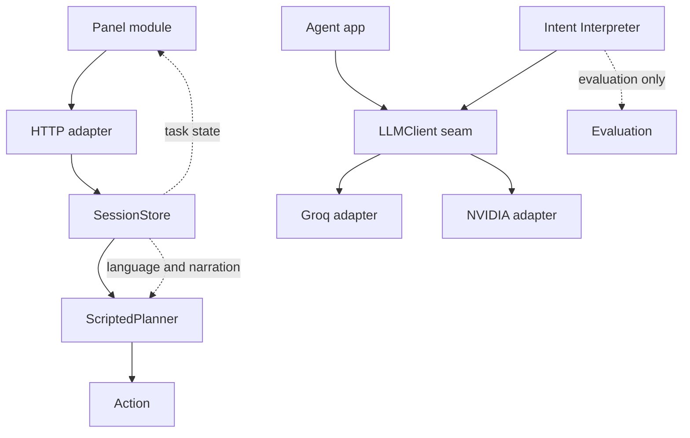
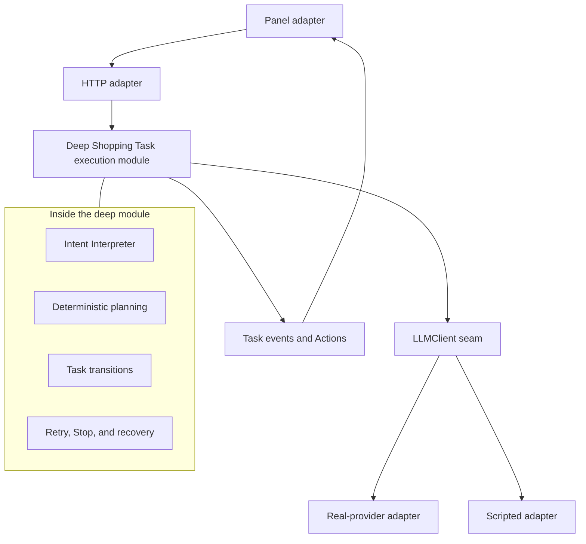
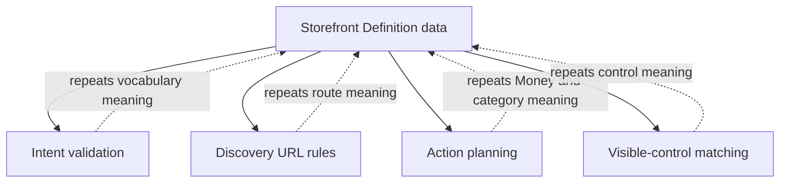
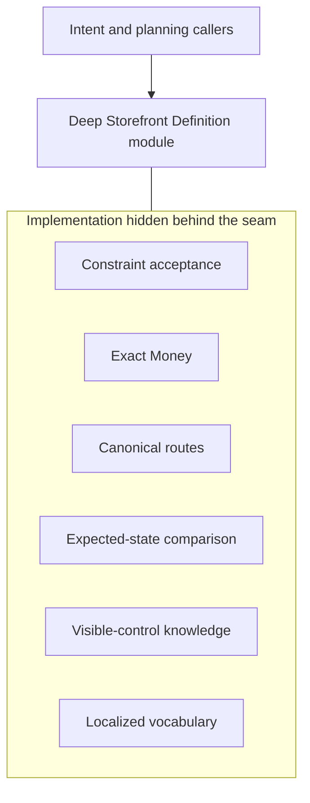
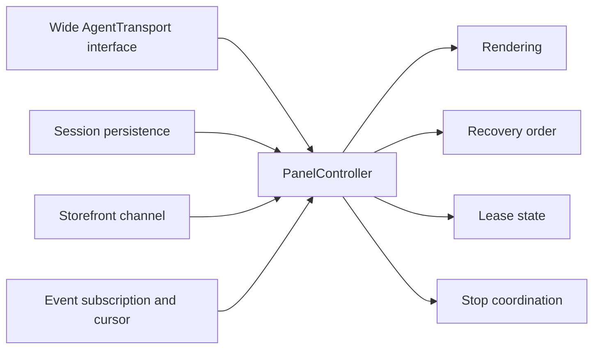
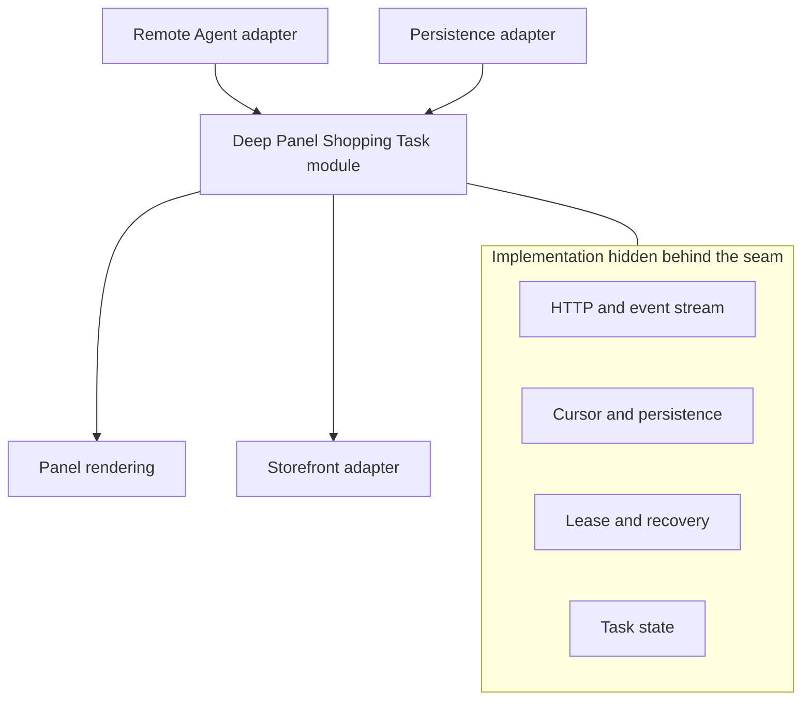

# Architecture Review — Shopping Copilot

**Reviewed:** 21 September 2026\
**Recent hotspot:** Agent-side Shopping Task path\
**Architecture decisions:** No `docs/adr/` directory found\
**Scope:** Preserve the local MVP gate and all Action safety invariants

## Legend

- **Module:** solid box
- **Seam:** dashed connection
- **Leakage:** red or dotted connection
- **Deep module:** a small interface hiding substantial implementation

## Candidate 1 — Deepen Shopping Task execution

**Recommendation:** Strong\
**Dependency category:** Mock for the external model dependency; in-process for deterministic decisions

**Files**

- `agent/app.py:58–74`
- `agent/sessions.py:80–499`
- `agent/planner.py:118–387`
- `agent/llm/intent_pipeline.py:28–297`
- `panel/src/panel.ts:286–316`

### Problem

Shopping Task policy leaks across session state, deterministic planning, unused Intent Interpreter plumbing, and Panel status handling. Ticket 07E adds asynchronous interpretation, provider failure, Retry, and Stop pressure to every seam.

The current paths are parallel:

- `agent/app.py` constructs the selected model adapter.
- Live Shopping Tasks still send raw Shopper text through `ScriptedPlanner`.
- The Intent Interpreter produces a validated Structured Intent only for isolated tests and evaluation.
- Session transitions, Action identity, recovery, narration, and completion remain coordinated separately.

Deleting either interpretation path would not remove its complexity; the missing behavior would reappear across `app.py`, `sessions.py`, and `planner.py`.

### Before

### After

### Solution

Deepen one Shopping Task execution module so interpretation, deterministic planning, Action identity, Retry, Stop, and refresh recovery remain local. HTTP, model-provider, and Panel code remain adapters.

### Benefits

- **Locality:** one transition authority
- **Leverage:** every Shopping Task path reuses the policy
- The interface becomes the test surface
- Stale and duplicate Action rules stay local
- Provider failure cannot emit an Action
- Retry cannot replay an uncertain Action
- Stop can invalidate late model work

### Testing effect

Replace separate tests of interpretation, planning, and session choreography with observable tests that cross the Shopping Task module’s interface. The scripted model adapter keeps ordinary tests network-free.

---

## Candidate 2 — Deepen the Storefront Definition module

**Recommendation:** Strong\
**Dependency category:** In-process after locally loading the validated JSON definition

**Files**

- `agent/storefront.py:30–309`
- `agent/discovery.py:12–133`
- `agent/llm/intent_pipeline.py:188–195, 250–262`
- `agent/planner.py:163–211, 274–387`

### Problem

The Storefront Definition is authoritative but shallow. Its interface exposes raw category, filter, vocabulary, route, and currency data, so callers repeatedly interpret the same meaning.

Storefront knowledge is currently distributed across:

- Intent Constraint validation
- Exact Money validation
- Canonical discovery URL construction and parsing
- Expected-state comparison
- Visible-control fallback planning
- Localized category and control vocabulary

Deleting the current Storefront Definition module would leave this knowledge duplicated across callers. Moving the behavior behind its seam would concentrate the complexity.

### Before

### After

### Solution

Move supported Constraint decisions, Money handling, canonical discovery routes, expected-state comparison, and visible-control vocabulary behind the Storefront Definition seam.

### Benefits

- **Locality:** Storefront meaning stays together
- **Leverage:** every planning path uses the same decisions
- One interface becomes the test surface
- Exact Money rules stop leaking
- Model and deterministic paths accept the same vocabulary
- Visible-control fallback remains coherent with canonical routes

### Testing effect

Move behavior tests to the Storefront Definition interface. Intent and planning tests should assert only their observable outcomes rather than retesting Storefront-specific rules.

---

## Candidate 3 — Collapse Panel Shopping Task coordination

**Recommendation:** Worth exploring\
**Dependency category:** Ports and adapters; the remote Agent and in-memory test adapter make the seam real

**Files**

- `panel/src/panel.ts:75–316`
- `panel/src/main.ts:19–147, 184–210`
- `panel/tests/panel-controller.test.ts:23–142`

### Problem

The `AgentTransport` interface mirrors nine remote operations. `PanelController` must understand session creation, cursor persistence, lease takeover, reconciliation, event ordering, Stop, cancelled-task memory, Storefront messaging, and rendering state.

The test setup rebuilds the same wide transport interface, which is a strong sign that callers and tests must learn too much protocol choreography.

Deleting `PanelController` would spread its task coordination into rendering code and the browser entry point. The module earns its keep, but its interface can become deeper by hiding remote conversation and recovery details.

### Before

### After

### Solution

Deepen a Panel-side Shopping Task module that owns remote Agent conversation, cursor persistence, lease takeover, and refresh recovery. Rendering and Storefront messaging remain callers at separate seams.

### Benefits

- **Locality:** recovery order stays together
- **Leverage:** every Panel state uses one task model
- Rendering learns fewer protocol facts
- Tests assert task outcomes instead of remote call order
- HTTP and in-memory adapters justify the seam
- Reconnection and Stop behavior remain consistent

### Testing effect

Keep browser-visible tests at the Panel interface. Replace the large remote-operation fake with a smaller in-memory adapter that produces task states and accepts Shopper decisions.

---

## Top recommendation

**Deepen Shopping Task execution first.**

Ticket 07E is the active implementation frontier. It is about to add asynchronous interpretation, provider failure, Retry, and Stop to the live Shopping Task path. Concentrating those decisions first creates the highest locality and protects every Action safety invariant before more callers learn the choreography.

The Storefront Definition opportunity is the strongest follow-up because it lets both model-driven and deterministic planning rely on one authoritative interpretation of Constraints, Money, vocabulary, routes, and visible controls.

## Deliberately excluded

Generated Python and TypeScript interaction contracts are not a current candidate. The approved specification explicitly keeps v1 contracts manually mirrored while the protocol changes rapidly and defers generation until the local protocol stabilizes.
