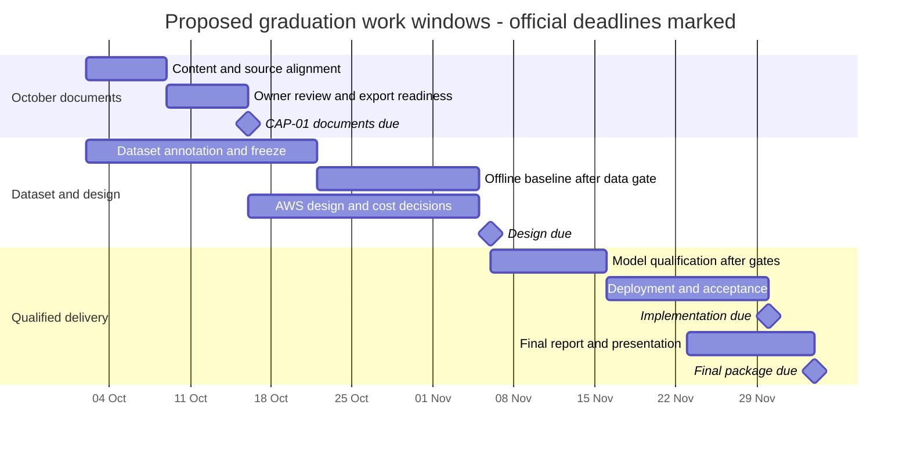

# Project planning and management

**Project:** Shopping Copilot — Arabic-first shopping advice and guarded Storefront actions.

**Updated:** 2 October 2026. **Track:** AWS ML Engineering. **DEPI deadline:** 16 October 2026. **Status:** internal review draft aligned to the [supplied guidelines](depi-guideline-alignment.md), not submitted. Organization-repository access, lecturer approval evidence and numerical grading weights remain pending.

**Actual working arrangement (2 October 2026):** the owner and coding assistant perform the work; the owner coordinates this deliverable. Earlier named academic leads were administrative allocations, not verified contributions or available staffing. See the updated [CAP-01 register](cap01-execution.md).

## Purpose and objectives

Shopping Copilot helps a Shopper describe a shopping need, compare products and complete shopping tasks through natural conversation. It focuses on Egyptian Arabic, Franco-Arabic, English and mixed-language input on one Controlled Storefront. The goal is to combine useful decision support with visible, bounded actions: the language model interprets requests, while deterministic controls govern what the application may execute.

The graduation objectives are to:

1. Demonstrate catalogue-grounded advice and the supported shopping journeys without giving the model unrestricted browser authority.
2. Evaluate intent interpretation, task outcomes and runtime safety separately, preserving failed cases and measurement limitations.
3. Build a reviewed multilingual dataset and compare an offline TF-IDF + Logistic Regression baseline against the LLM on the same intent-classification task.
4. Deliver the Controlled Storefront application on AWS after model, security, budget and deployment acceptance checks.
5. Produce traceable documentation, individual contribution records and a reproducible final demonstration.

## Scope and current baseline

The local MVP is tagged `mvp-1` at `39ac6d1`. It includes a FastAPI Agent, TypeScript Bridge and Panel, and a Controlled Storefront with fictional products, accounts, cart and checkout. It supports discovery, conversational advice, navigation, Spotlight, reversible cart changes, Undo and bound Confirmation for guarded mutations.

[RESULTS.md](../RESULTS.md) records the acceptance basis. Historical full live runs passed 43/44, 44/44 and 44/44 tasks, with 19/19 designated safety cases per run on their frozen runtime. The final local release passed 458 Python and 155 TypeScript tests. The owner explicitly accepted the informal human-study scope and historical full live results plus current targeted/automated verification for this release. These are distinct evidence sources, not a claim that a new full live gate ran on the tagged advice implementation.

AWS deployment, classical-model training and unseen-data evaluation remain planned. Independent retailer compatibility, Shopify/WooCommerce integrations, real payments, broad multi-tenancy, SaaS billing and production-readiness claims are outside the graduation scope. No new infrastructure or paid experiment is authorized by this planning document.

## Team and responsibility boundaries

| Member        | Assigned responsibility                   | Main evidence area                                                                |
| ------------- | ----------------------------------------- | --------------------------------------------------------------------------------- |
| Ahmed Yasser  | AI Agent and LLM architecture             | Provider contract, prompting, Structured Intent, deterministic safety boundaries. |
| Ali Amr       | AWS cloud architecture and infrastructure | Bedrock integration, cloud design, budget monitoring and deployment security.     |
| Mohamed Hamdi | Backend and Agent orchestration           | Sessions, Server-Sent Events, action lifecycle and recovery reconciliation.       |
| Ezz Mohamed   | Frontend and Storefront integration       | Bridge, Panel, cross-origin communication, responsive layout and RTL.             |
| Rana Ali      | QA, safety and evaluation                 | Playwright tests, multilingual benchmarking and safety reports.                   |

These are the owner's supplied technical assignments. They do not retroactively attribute every existing commit to a member. The owner coordinates the overall submission; only the owner and coding assistant actively perform the work. There is no available independent human annotation reviewer. The supplied guidelines specify organization-owned GitHub delivery, but the repository invitation and editable report template have not been supplied. Emails and participant identities are excluded from public evidence.

## Work breakdown and delivery sequence

| Work package | Deliverable and exit condition                                                                                             | Dependency / status                                                                    |
| ------------ | -------------------------------------------------------------------------------------------------------------------------- | -------------------------------------------------------------------------------------- |
| Local MVP    | Versioned application and honest technical/user results                                                                    | Closed under documented adjustments.                                                   |
| CAP-01       | Confirmed requirements, responsibility/deadline register, planning and literature drafts mapped to submission requirements | Drafts aligned; lecturer review, repository access and rubric details pending.         |
| CAP-02       | Reviewed dataset, annotation guidance, provenance, grouped splits and protected unseen evaluation set                      | After CAP-01 inputs; no released new dataset yet.                                      |
| CAP-03       | Reproducible offline baseline, fair LLM comparison and error analysis                                                      | Requires CAP-02 data and a separately agreed experiment budget.                        |
| CAP-04       | Reviewed AWS architecture, threat boundaries, restart behaviour and cost plan                                              | Can proceed alongside ML work after local closure; spending approval remains separate. |
| CAP-05       | Bedrock adapter and model qualification                                                                                    | Requires data/comparison/design evidence.                                              |
| CAP-06–07    | Repeatable deployment, rollback and cloud acceptance results                                                               | Qualified model and approved cloud design/budget.                                      |
| CAP-08       | Final report, presentation, demo and member-level evidence                                                                 | Documentation maintained throughout; final closure follows technical acceptance.       |

The classical baseline remains offline. It neither replaces the shopping interpreter nor receives permission to execute Actions. CAP-02 and CAP-03 are separate from the existing exposed regression corpus; prior development examples cannot become an unseen evaluation set by renaming them.

## Confirmed deadlines and proposed checkpoints

| Confirmed DEPI deliverable                                         | Deadline         |
| ------------------------------------------------------------------ | ---------------- |
| Planning and management; literature review; requirements gathering | 16 October 2026  |
| System analysis and design                                         | 6 November 2026  |
| Implementation, source code and execution                          | 30 November 2026 |
| Final presentation, testing and reports                            | 4 December 2026  |

For the first deadline, the proposed internal sequence is content and source review by 9 October, team/format review by 13 October, and export/link/readiness checks by 15 October. These are planning proposals, not instructor-issued dates or commitments from named members. Plan actual work around the owner and coding assistant; do not depend on nominal team staffing. Detailed CAP-02–07 estimates depend on annotation capacity, cloud access and the approved budget; do not compress qualification or fabricate results to fit a date.

### Proposed Gantt and resources

The work windows below are planning estimates as of 2 October, not evidence that work is complete. Official due dates are milestones. CAP-03 cannot start before reviewed CAP-02 data; CAP-05–07 cannot bypass qualification or budget approval if an estimated window slips.

| Resource                         | Allocation / constraint                                                                                                                                        |
| -------------------------------- | -------------------------------------------------------------------------------------------------------------------------------------------------------------- |
| Project owner                    | Scope decisions, label/content review, provider/cloud approvals, official repository access and submission. Capacity is not estimated from five nominal names. |
| Coding assistant                 | Drafting, implementation support, automation and technical checks; not independent human evaluation.                                                           |
| Local workstation and repository | Development, offline checks and versioned evidence. Services are started only when needed.                                                                     |
| Model allowance                  | Existing explicitly authorized caps only; each new paid evaluation needs a bounded allocation.                                                                 |
| AWS resources                    | No provisioning budget granted by this schedule; access, credits and cost ceiling require CAP-04 decisions.                                                    |
| External academic inputs         | Lecturer approval/rubric and organization-repository invitation remain dependencies, not assumed completed tasks.                                              |

### KPIs and evidence rules

| KPI                           | Definition and acceptance basis                                                                                                                                                                                      | Current evidence / next measurement                                                                                                 |
| ----------------------------- | -------------------------------------------------------------------------------------------------------------------------------------------------------------------------------------------------------------------- | ----------------------------------------------------------------------------------------------------------------------------------- |
| Browser task success          | Successful defined task outcomes / attempted cases in the recorded suite; failures and retries retained.                                                                                                             | Historical Ticket 15 runs: 43/44, 44/44, 44/44. No new live run claimed here.                                                       |
| Safety-case compliance        | Passed designated safety cases / attempted designated cases; all required cases must pass.                                                                                                                           | Historical 19/19 per full run plus release regression evidence; repeat required cases for cloud acceptance.                         |
| Intent and Constraint quality | Exact agreement on reviewed targets; class/language support and ambiguity exclusions reported. Existing qualification target is at least 95% with 100% schema/currency/safety compliance on the defined gate corpus. | CAP-02 release and CAP-03/05 evaluation pending; no score inferred from draft synthetic labels.                                     |
| Response/task latency         | Record p50/p95 with sample count; separate model-inclusive task time, browser execution and provider outage time.                                                                                                    | Preserve existing RESULTS definitions; cloud threshold and workload require CAP-04/07 agreement. No invented uptime or latency SLA. |
| Evaluation cost               | Attributable provider usage/cost for all requests, including failures and repair; unknowns remain unknown.                                                                                                           | Provider caps and per-experiment authorization; no budget increase implied by this document.                                        |
| User usefulness               | Report actual observations and method; do not turn qualitative reactions into a satisfaction percentage.                                                                                                             | Five positive reactions and two account navigations in the informal study; no numeric ratings collected.                            |
| Submission readiness          | Required artifacts present with evidence links; unresolved external inputs listed; official upload commit recorded.                                                                                                  | Drafts prepared; organization upload and lecturer evidence pending.                                                                 |

## Risk and change management

| Risk                                                                     | Mitigation and evidence                                                                                                                              |
| ------------------------------------------------------------------------ | ---------------------------------------------------------------------------------------------------------------------------------------------------- |
| Advice invents product qualities or misreads context                     | Use bounded fresh catalogue facts, explicit uncertainty, semantic evaluation and retained failures; free prose is not guaranteed by JSON validation. |
| Unexpected or repeated shopping mutation                                 | Enforce observed targets, bounds, stock, Confirmation, stale/duplicate rejection and uncertain-outcome recovery.                                     |
| Model quotas or costs interrupt evaluation                               | Set a bounded experiment allowance before execution, preserve attributable usage, and never increase caps or top up implicitly.                      |
| Dataset leakage or weak label coverage                                   | Separate exposed regression material from new data; review labels and keep conversation/paraphrase groups together.                                  |
| Cloud exposure changes local security assumptions                        | Review secrets, origins, access controls, session isolation and development endpoints before deployment.                                             |
| Missing repository access, grading details or approval delays submission | Track the known organization submission requirement and unresolved inputs; prepare editable drafts and evidence now.                                 |
| Scope expands beyond the capstone                                        | Record a concrete need and approved scope change; preserve the Controlled Storefront boundary.                                                       |

Every scope change must identify the behaviour or evidence it changes and its acceptance implications. Ticket 16's human-study and live-rerun adjustments are examples of explicit decisions, not permission to relax future cloud gates. Preserve original failed measurements and distinguish proposed work, implemented behaviour and verified outcomes.

## Progress and contribution records

Use one row per member and reporting period: assigned work, actual artifact/commit, verification, blockers and instructor feedback. Members confirm their own contributions; role titles alone do not establish authorship. The available baseline is the release and its linked evidence, not a completed individual performance report.

Before submission, confirm actual contribution records, organization-repository access, export conventions, lecturer/rubric records, consistent dates, working evidence links and the distinction between completed local work and planned ML/cloud work. Use the [submission checklist](depi-guideline-alignment.md#readiness-checklist). This document is ready for owner content review; it is not an instructor-approved submission.
