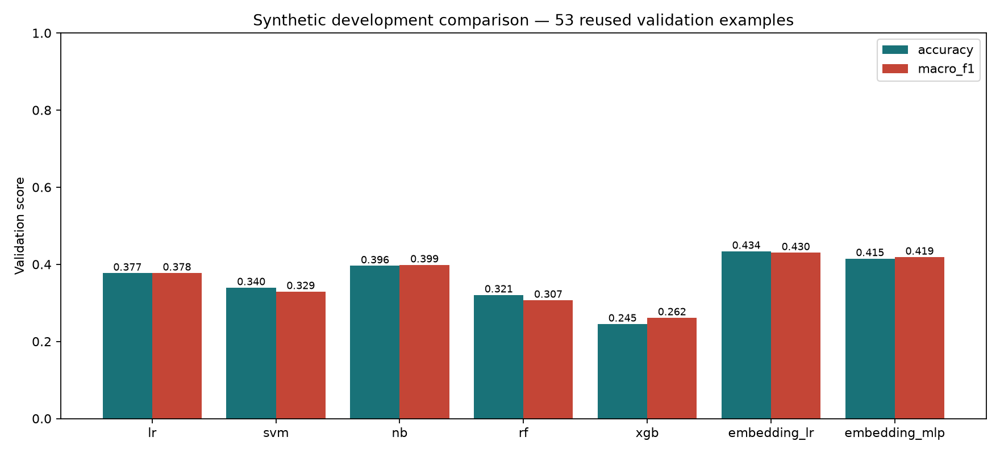

# Seven-model offline comparison — 7 October 2026

[Open the executed Jupyter notebook](../notebooks/cap03-model-comparison.ipynb) for tables, charts, all trials and selectable error analysis. Run All reads the saved evidence without retraining.

**Frozen multilingual embeddings + Logistic Regression led this exploratory comparison: 23/53 correct, 43.40% accuracy and ten-label macro-F1 0.4304.** The embedding MLP scored 22/53; the strongest TF-IDF model was Complement Naive Bayes at 21/53. Differences of one or two examples are not evidence of reliable superiority. Overall classification quality remains weak.

The owner approved seven model families and subsequently authorized the local RTX 3060. The [pre-fit protocol](cap03-model-comparison-protocol.md) fixes 46 candidates and the unchanged [210-training / 53-validation release](../eval/datasets/capstone-v1/pilot-20261007/release.json). All 46 fits converged; none failed or was discarded for nonconvergence. Validation selected each family configuration; there was no refitting on validation or post-score expansion. Existing pilots are unchanged.

## Results

| Model                                   | Correct / 53 | Accuracy | Macro-F1 | Fits |
| --------------------------------------- | ------------ | -------- | -------- | ---- |
| Frozen embeddings + Logistic Regression | 23           | 43.40%   | 0.4304   | 6    |
| Frozen embeddings + MLP                 | 22           | 41.51%   | 0.4189   | 4    |
| TF-IDF + Complement Naive Bayes         | 21           | 39.62%   | 0.3987   | 4    |
| TF-IDF + Logistic Regression            | 20           | 37.74%   | 0.3776   | 12   |
| TF-IDF + Linear SVM                     | 18           | 33.96%   | 0.3294   | 12   |
| TF-IDF + Random Forest                  | 17           | 32.08%   | 0.3071   | 4    |
| TF-IDF + XGBoost                        | 13           | 24.53%   | 0.2615   | 4    |



The fixed training-majority reference (`cart_edit`) scores 4/53, 7.55% accuracy and macro-F1 0.0140 on the same release. The Logistic Regression rerun reproduces every prediction from pilot 2. These label scores do not evaluate runtime conversation, advice quality, Constraint extraction or cart safety.

| Family                                  | Selected settings                                                       |
| --------------------------------------- | ----------------------------------------------------------------------- |
| TF-IDF + Logistic Regression            | `{"features": "char_wb", "C": 0.1, "class_weight": "balanced"}`         |
| TF-IDF + Linear SVM                     | `{"features": "word", "C": 1.0, "class_weight": "balanced"}`            |
| TF-IDF + Complement Naive Bayes         | `{"features": "char_wb", "alpha": 0.1}`                                 |
| TF-IDF + Random Forest                  | `{"features": "char_wb", "max_depth": 10}`                              |
| TF-IDF + XGBoost                        | `{"features": "char_wb", "max_depth": 6}`                               |
| Frozen embeddings + Logistic Regression | `{"features": "embedding", "C": 0.1, "class_weight": null}`             |
| Frozen embeddings + MLP                 | `{"features": "embedding", "hidden_layer_sizes": [128], "alpha": 0.01}` |

## Language and failure analysis

| Model                                   | Egyptian Arabic (13) | Franco-Arabic (13) | English (14) | Mixed (13) |
| --------------------------------------- | -------------------- | ------------------ | ------------ | ---------- |
| TF-IDF + Logistic Regression            | 38.46%               | 23.08%             | 35.71%       | 53.85%     |
| TF-IDF + Linear SVM                     | 30.77%               | 15.38%             | 42.86%       | 46.15%     |
| TF-IDF + Complement Naive Bayes         | 46.15%               | 23.08%             | 28.57%       | 61.54%     |
| TF-IDF + Random Forest                  | 38.46%               | 15.38%             | 35.71%       | 38.46%     |
| TF-IDF + XGBoost                        | 30.77%               | 15.38%             | 21.43%       | 30.77%     |
| Frozen embeddings + Logistic Regression | 46.15%               | 23.08%             | 50.00%       | 53.85%     |
| Frozen embeddings + MLP                 | 38.46%               | 15.38%             | 71.43%       | 38.46%     |

Each language slice is tiny and differently composed. For the selected embedding Logistic Regression, advice improved to 3/4 and product search to 4/4, but guarded mutation remained 0/4, unsupported requests 4/12 and off-topic 1/8. The MLP scored advice 4/4 and mutation 1/4, but only 2/13 Franco-Arabic messages correctly. Inspect the per-case predictions before attributing these differences to language understanding or capacity. No Action was executed by any classifier.

In this fixed experiment, pretrained representations were more promising than increasing classifier complexity on TF-IDF. That is an observation on these configurations and examples, not a universal ranking of algorithms. The frozen encoder already contains external pretraining; this is not equal training-data exposure between representations. Classifier tuning budgets differ, and there is no seed-variance study.

## Timing, hardware and artifacts

Classifiers used CPU execution capped at four threads. The embedding encoder ran on the owner’s **NVIDIA GeForce RTX 3060, 12 GiB VRAM**, with PyTorch **2.14.1+cu130 / CUDA 13.0**; the classical phase used the CPU build of the same PyTorch version, which it does not import for fitting. The machine has about 31.8 GiB system RAM. These are hardware-dependent local measurements, not a matched-hardware speed benchmark.

| Model                                   | Warm p50 ms | Warm p95 ms | Selected fit seconds | Local classifier artifact MiB |
| --------------------------------------- | ----------- | ----------- | -------------------- | ----------------------------- |
| TF-IDF + Logistic Regression            | 0.486       | 0.617       | 0.036                | 0.867                         |
| TF-IDF + Linear SVM                     | 0.398       | 0.634       | 0.008                | 0.276                         |
| TF-IDF + Complement Naive Bayes         | 0.719       | 0.988       | 0.017                | 1.633                         |
| TF-IDF + Random Forest                  | 24.029      | 24.746      | 0.218                | 1.253                         |
| TF-IDF + XGBoost                        | 0.807       | 1.197       | 1.980                | 1.166                         |
| Frozen embeddings + Logistic Regression | 7.735       | 9.907       | 0.073                | 0.026                         |
| Frozen embeddings + MLP                 | 8.525       | 12.128      | 0.120                | 0.596                         |

Embedding systems additionally require the shared **471.6 MiB encoder**; their small classifier artifacts are not complete deployment sizes. Initializing the cached encoder took 2.080 s; preparing all 263 fixed embeddings took 0.508 s. No messages were truncated at the encoder’s 128-token limit. Embedding latency includes fresh tokenization, GPU encoding, transfer to CPU and classification, with CUDA synchronization; it is not cached head-only latency. Head fitting excludes the separately reported shared encoding time. Artifact reload timings in the JSON concern the classifier bundle, not total process/encoder cold startup.

The first encoder-weight download and CUDA package setup were one-time setup work, excluded from warm timings. A stalled CUDA mirror was replaced with a verified download from the official primary host; the installed Windows wheel matched the official SHA-256 `0a09031e93632d14ef49553acd6211ece3ae9cdc0969a369b8c24e3cc4d15be9`. Local compute/electricity cost was not measured. **No paid inference calls, provider-key changes or cloud resources.**

## Reproduce and inspect

Install the evaluation dependencies in Python 3.12; they remain separate from application dependencies. For this Windows/Python 3.12 GPU environment:

```powershell
python -m pip install -r eval/requirements-comparison.txt
python -m pip install "https://download.pytorch.org/whl/cu130/torch-2.14.1%2Bcu130-cp312-cp312-win_amd64.whl"
python -m eval.compare_models --release eval/datasets/capstone-v1/pilot-20261007/release.json --output outputs/model-comparison/new-classical --phase classical
python -m eval.compare_models --release eval/datasets/capstone-v1/pilot-20261007/release.json --output outputs/model-comparison/new-embeddings --phase embeddings
python -m eval.plot_model_comparison --reports outputs/model-comparison/new-classical/report.json outputs/model-comparison/new-embeddings/report.json --output outputs/model-comparison/new-figures
```

Use fresh output paths. Other platforms need their matching official PyTorch build; CPU fallback is supported and disclosed. The frozen encoder uses a pinned public revision, local inference, safetensors and disabled remote code. No shopper messages are sent to an inference API.

The [classical report](../eval/evidence/cap03-comparison-20261007/classical.json) and [embedding report](../eval/evidence/cap03-comparison-20261007/embeddings.json) retain all trials, per-case predictions, metrics, matrices, package/source/release hashes and invocation details. The [figures directory](../eval/evidence/cap03-comparison-20261007/figures) includes raw and normalized matrices for every selected family. The run used uncommitted experiment code atop `227059b`; source hashes identify the actual files.

Local selected models remain under ignored `outputs/model-comparison/{classical,embeddings}-001/`. The embedding phase also saves `embeddings.npz` with arrays, ordered case IDs, shapes, encoder revision and release/file hashes in its report. Load NumPy arrays with `allow_pickle=False`; only load joblib artifacts produced by your trusted local run. The encoder cache is shared under ignored `outputs/model-cache`. Model bytes and timing can vary across environments.

## Verification and remaining limits

Fourteen focused regressions cover train-only vocabulary/scaling, selection failure handling, multiclass artifact round trips across all seven backends, existing-output protection, persisted failed trials, and encoder-inclusive timing. Full Python run: **485 passed / one browser infrastructure failure** (`Browser.new_page: Response has been disposed`); the affected SPA test then passed in isolation. All **486 distinct Python tests** therefore have passing evidence, without claiming an uninterrupted green full run. All **155 TypeScript tests**, builds/typechecks, ESLint, Ruff and repository formatting passed. Runtime source and earlier frozen evidence are unchanged.

All data remains exposed synthetic development material; the 53 validation examples were already inspected in earlier pilots. Repeated family/hyperparameter selection further biases the reported maxima. CAP-02 independent evaluation and CAP-03 final same-input LLM comparison remain open. None of these models replaces the Shopping Copilot runtime.
