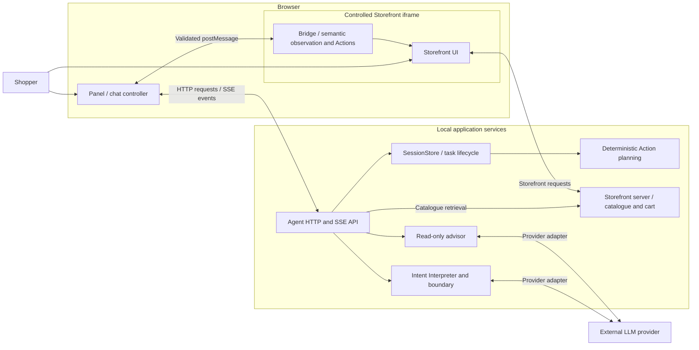
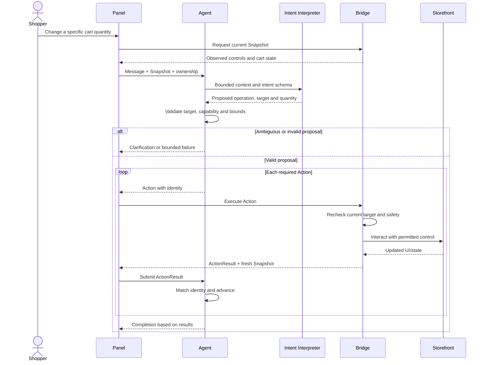
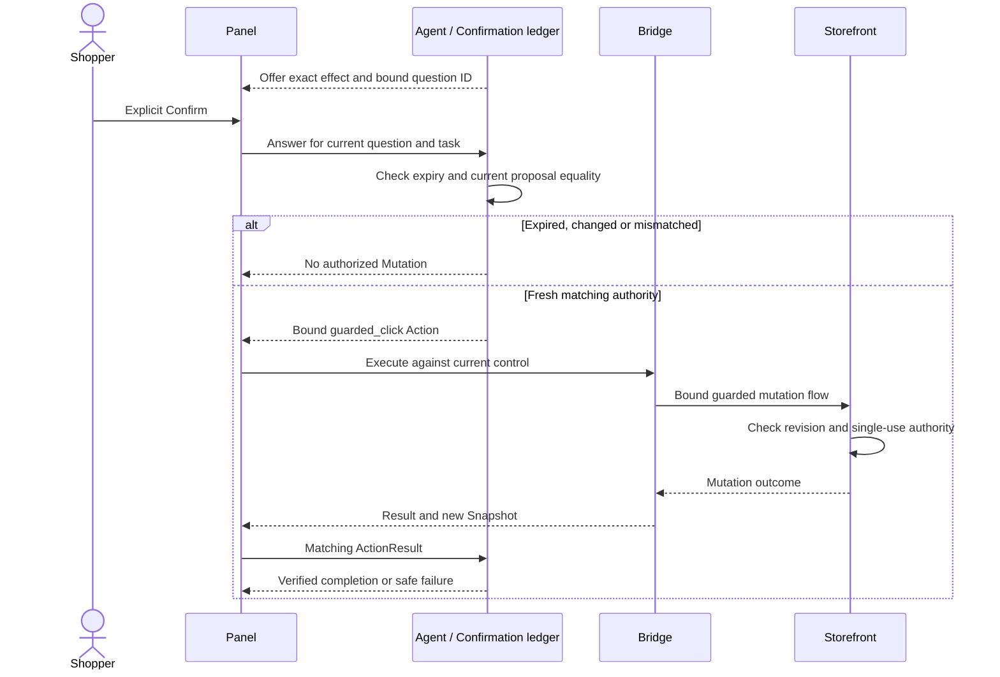
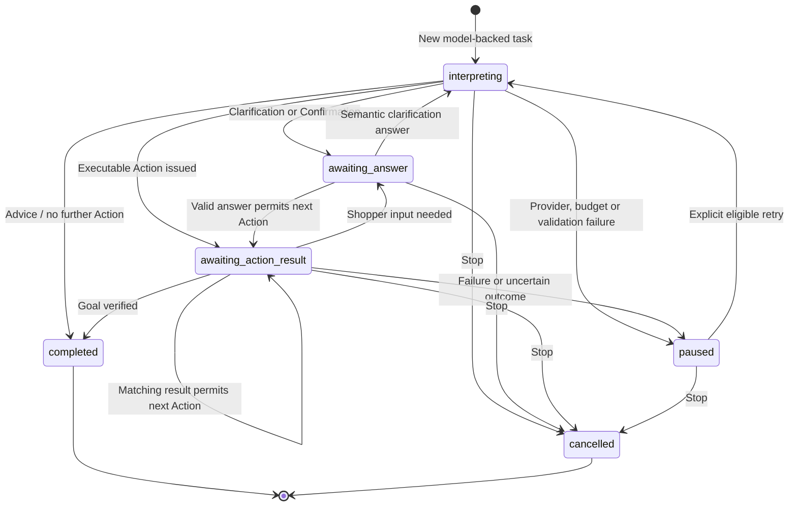
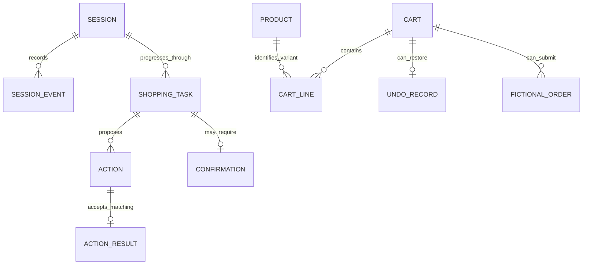
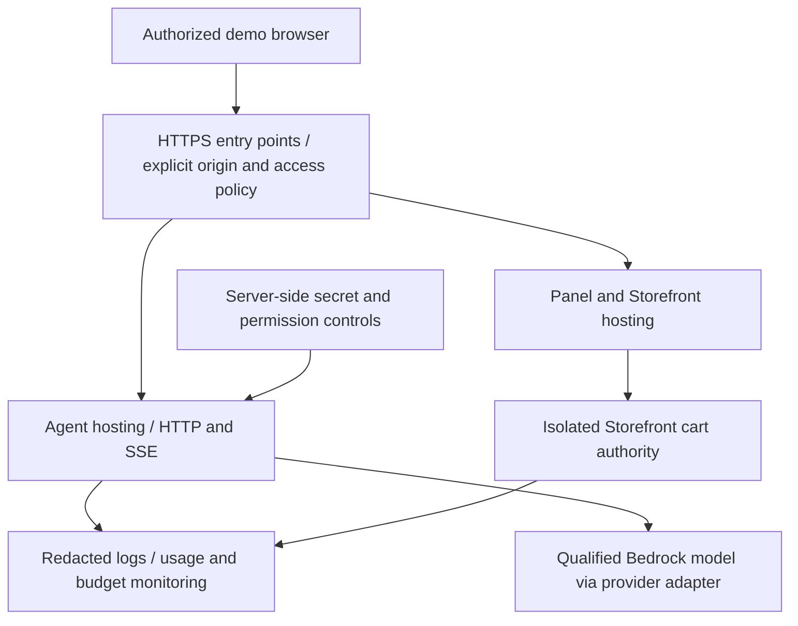

# Shopping Copilot: System Analysis & Design

Updated: 2 October 2026. Track: **AWS ML Engineering**. DEPI deadline: **6 November 2026**.

Status: **local-system design documented; cloud design awaiting CAP-04 decisions**. Behaviour/evidence is anchored to local MVP `mvp-1` (`39ac6d1`); structure incorporates session refactor `7df44d9`. The [additional design views](system-design-views.md) supply the use-case, DFD, activity, class, deployment and wireframe views requested by the [guidelines](depi-guideline-alignment.md). Prepared for owner review; no instructor approval or submission claimed.

## 1. Problem, purpose and scope

Shoppers can struggle both to choose between products and to carry out shopping steps. Shopping Copilot combines conversation grounded in Catalogue Facts with visible, controlled Storefront interactions. The LLM interprets the Shopper's language and references; runtime code checks whether a proposed interaction is supported and safe. Advice helps the Shopper decide without gaining authority to execute an Action.

The implemented scope is one project-owned Controlled Storefront, multilingual text, optional speech transcription, catalogue discovery, product explanations/comparisons, navigation, cart editing, ten-second Undo, guarded cart clearing and fictional checkout, account/order guidance, Stop and refresh reconciliation. Payment, login and other Sensitive Fields remain manual.

The graduation extension comprises a reviewed multilingual dataset, an offline classical intent-classification baseline, AWS model qualification and a protected AWS deployment of this same Storefront. Arbitrary retailers, Shopify/WooCommerce integration, real payments and multi-tenant SaaS are outside this deliverable. Laptop shopping was a participant's illustration, not an expansion of the catalogue.

Requirements and priorities are defined in [CAP-01 requirements](cap01-requirements.md); dates and responsibilities are recorded in [the execution register](cap01-execution.md). [CONTEXT.md](../CONTEXT.md) defines the domain vocabulary.

## 2. Stakeholders and analysis evidence

| Actor                                 | Interaction or responsibility                                                                                                         |
| ------------------------------------- | ------------------------------------------------------------------------------------------------------------------------------------- |
| Shopper                               | Express needs, compare products, authorize consequential choices, inspect results, stop or undo permitted changes.                    |
| Project team                          | Maintain the Controlled Storefront, implementation, prompts, evaluation and deployment. Technical allocations are recorded in CAP-01. |
| Evaluator / DEPI reviewer             | Inspect reproducible evidence, limitations, design decisions and individual contributions.                                            |
| External model/transcription provider | Process bounded requests through server-side adapters; its output is untrusted input to runtime validation.                           |

The informal study consisted of five people exploring without facilitator help, according to the owner. All five reacted positively after advice was added; two successful account navigations were reported. The original feedback concerned mechanical conversation and insufficient decision support. These observations motivate advice alongside execution; they do not establish a measured success rate, representative population or complete task coverage. See [Ticket 16 closeout](ticket16-closeout.md).

## 3. Use cases

| ID    | Goal and normal flow                                                                                                           | Preconditions / alternative flow                                                                                       | Observable completion                                                                     |
| ----- | ------------------------------------------------------------------------------------------------------------------------------ | ---------------------------------------------------------------------------------------------------------------------- | ----------------------------------------------------------------------------------------- |
| UC-01 | Discover products: interpret needs, retrieve catalogue evidence, assess explicit Constraints and present results/explanations. | Supported Storefront; unknown or unmet requirements are disclosed. Ask for clarification when needed.                  | Exact Matches, Alternatives or Styling Suggestions are distinguished.                     |
| UC-02 | Discuss a choice: compare verified properties, explain trade-offs and ask a useful follow-up.                                  | Evidence exists for referenced products; missing quality/comfort facts remain unknown.                                 | Read-only response and relevant cards; no cart change.                                    |
| UC-03 | Navigate to a product, cart or account, or Spotlight a control.                                                                | Resolve an observed destination/product; reject off-origin or unobserved targets.                                      | ActionResult confirms navigation or visual guidance.                                      |
| UC-04 | Add a variant, edit quantity or remove a cart line.                                                                            | Resolve exact product/variant/line from current state; validate quantity and availability.                             | Intended line changes and unrelated lines remain intact; Undo is offered for ten seconds. |
| UC-05 | Undo the last eligible cart change.                                                                                            | Original Undo record is still valid; refresh does not restart its deadline.                                            | Exact prior cart state restored.                                                          |
| UC-06 | Empty cart or submit fictional checkout.                                                                                       | Fresh Confirmation bound to the precise effect and current cart revision; reject changed, expired or reused authority. | One authorized effect, reported from execution evidence.                                  |
| UC-07 | Find newest order / handle account access.                                                                                     | Sensitive input is entered by the Shopper; Copilot may guide permitted controls.                                       | Relevant page/control is shown without collecting credentials.                            |
| UC-08 | Stop, refresh or transfer control to another tab.                                                                              | Existing session and ownership are checked; uncertain effects require reconciliation.                                  | No stale Action execution or automatic replay of an uncertain Mutation.                   |
| UC-09 | Dictate a request.                                                                                                             | Selected speech service is available and browser permissions permit recording.                                         | Editable transcription; Shopper sends the request, or types when speech is unavailable.   |

These flows describe capabilities, not a list of accepted phrases. Egyptian Arabic, English, code-switching, misspellings and negations belong to LLM interpretation and evaluation, not language dictionaries in the validator.

## 4. Implemented logical architecture

This is a responsibility diagram, not a claim that every box is a separate deployable service. Local ports are Panel **4100**, Storefront **4000**, Agent **8000**. The Bridge runs inside the Storefront document; the Panel communicates across the iframe boundary and forwards Actions/results. The model does not receive a browser handle or directly execute DOM operations.

| Component               | Implementation source                                                                                                     | Responsibility                                                                                                     |
| ----------------------- | ------------------------------------------------------------------------------------------------------------------------- | ------------------------------------------------------------------------------------------------------------------ |
| Panel                   | [panel.ts](../panel/src/panel.ts), [main.ts](../panel/src/main.ts), [event-stream.ts](../panel/src/event-stream.ts)       | Chat, cards, speech controls, Confirmation UI, session ownership, SSE and Bridge coordination.                     |
| Bridge                  | [runtime.ts](../bridge/src/runtime.ts), [snapshot.ts](../bridge/src/snapshot.ts), [actions.ts](../bridge/src/actions.ts)  | Semantic Snapshots, message validation, current-target checks, Action execution, Spotlight and execution feedback. |
| Agent API               | [app.py](../agent/app.py)                                                                                                 | Request validation, orchestration of model work, event streaming and speech endpoints.                             |
| Shopping Task lifecycle | [sessions.py](../agent/sessions.py)                                                                                       | Active task, events, ownership, context, planning progress, result identities, Stop/retry/reconciliation.          |
| Intent interpretation   | [intent_pipeline.py](../agent/llm/intent_pipeline.py), [intent.py](../agent/llm/intent.py)                                | Versioned model context/schema, bounded repair and semantic proposal validation.                                   |
| Discovery and advice    | [catalogue.py](../agent/catalogue.py), [advice.py](../agent/advice.py), [product_context.py](../agent/product_context.py) | Catalogue eligibility, grounded evidence, read-only explanations and bounded product context.                      |
| Execution policy        | [planner.py](../agent/planner.py), [cart.py](../agent/cart.py), [confirmation.py](../agent/confirmation.py)               | Supported Action sequences, target/bounds checks and bound Confirmation.                                           |
| Provider seam           | [contract.py](../agent/llm/contract.py), [factory.py](../agent/llm/factory.py)                                            | Provider-neutral request/response interface and configured adapter selection.                                      |
| Controlled Storefront   | [app.ts](../store/src/app.ts), [guarded-cart.ts](../store/src/guarded-cart.ts), [catalogue.ts](../store/src/catalogue.ts) | Authoritative product fixtures, rendered controls, cart revision, Undo and fictional orders.                       |

`SessionStore` is now a stable facade composing a registry and Shopping Task modules; SSE delivery has its own adapter. See the [class/module view](system-design-views.md#classes-and-module-composition) and [refactor record](session-modularity-refactor.md). The logical responsibilities remain; intent interpretation and ActionResult handling retain documented complexity. This is an incremental extraction, not elimination of all architecture debt.

## 5. Information flow and trust boundaries

1. The Bridge describes the current page as a semantic Snapshot: URL, title, language, viewport and observed elements. Sensitive Fields carry only minimal metadata; their values are excluded.
2. The Panel submits the Shopper message, Snapshot and session/tab identity to the Agent. Session context supplies recent conversation, known products and previous suggestions. Current observed cart controls/state inform interpretation; a pronoun or quantity change is not resolved by a phrase matcher.
3. The Intent Interpreter proposes a Structured Intent. The Intent Boundary checks supported fields/capabilities, observed references, bounds and compatible operations. Structured output is a proposal, not execution authority.
4. Discovery retrieves current catalogue evidence. Exact eligibility remains deterministic against explicit requirements. Advice receives bounded evidence and eligible references; unsupported prose claims are a quality risk assessed separately.
5. An execution request is translated into supported Actions. The Panel delivers each executable Action to the Bridge, which rechecks its target and current state. Guarded Mutations also require matching Confirmation enforced through the Storefront mutation flow.
6. The Bridge returns an ActionResult and fresh Snapshot. The Agent accepts only matching task/action/sequence identities, then completes, continues, asks the Shopper or pauses.

Browser messages, DOM/catalogue text and model replies are not trusted instructions. Origin/source checks constrain cross-frame messages; same-origin navigation and Sensitive Field rules constrain Actions. Catalogue content can ground facts but cannot authorize execution. Current local CORS configuration is not production authentication: cloud access control and server-side session isolation require separate design and verification.

## 6. Interaction sequences

### Ordinary cart change

### Guarded Mutation

Advice follows a shorter path: message → interpretation → catalogue evidence → read-only advice generation → validated response/references → chat/cards. It emits no executable Action. A later request to buy or navigate starts the normal execution path with fresh checks.

## 7. Shopping Task states and recovery

The stored statuses in `agent/sessions.py` are `interpreting`, `awaiting_action_result`, `awaiting_answer`, `completed`, `cancelled` and `paused`. The diagram shows principal paths, not every branch of the implementation.

Refresh is reconciliation, not a replay request. The Panel obtains server state and current Storefront observations; uncertain execution does not become an automatic retry. Stop invalidates further progress and late model/action results. Ownership is bound to a tab lease; another tab must take over explicitly. Session inactivity expiry is **30 minutes** in the current Agent. Missing/expired sessions require a new session; browser refresh recovery does not provide durability after server restart.

## 8. Logical data model and lifetime

This is a conceptual relationship model, **not a database schema**. SessionStore retains an active task, last task, context/events and accepted results; it is not a durable complete task-history database. The current Storefront cart is not owned by an Agent session.

| Object                | Essential identity / contents                                                                        | Storage and lifetime                                                                           |
| --------------------- | ---------------------------------------------------------------------------------------------------- | ---------------------------------------------------------------------------------------------- |
| Session               | Session ID, tab lease, active/last task, conversation, last Snapshot, product/advice context, events | Agent process memory; inactivity expiry; lost on restart.                                      |
| Shopping Task         | Task ID, status, message, resolved context, current Action, proposal/Confirmation                    | In-memory session lifecycle.                                                                   |
| Action / ActionResult | Task ID + Action ID + sequence number; proposed interaction / observed outcome                       | Matched by SessionStore; stale and duplicate attempts cannot repeat an effect.                 |
| Snapshot              | Version, URL, viewport and observed element IDs/metadata                                             | Observation for current-page planning; not a stable database of DOM targets.                   |
| Product / Money       | Product ID, explicit facts, variants, availability, decimal amount and configured currency           | Controlled catalogue source; fixture evidence, not external retailer inventory.                |
| Cart / CartLine       | Revision and product ID + size + colour identity, quantity                                           | **One GuardedCart per Storefront application instance**, in process memory.                    |
| Undo record           | Prior lines, ID, revision, original expiry                                                           | Latest eligible reversible change; ten-second window.                                          |
| Confirmation          | Task, target, effect, arguments, state signature and ID                                              | Agent offer expires after 60 seconds; Storefront also checks its own bound mutation authority. |
| Fictional order       | Order ID and copied cart lines                                                                       | Controlled in-memory cart/order state; no real payment or production fulfilment.               |

The shared Storefront cart is suitable only for the controlled local demonstration conditions. Separate Agent sessions and a fictional login cookie do **not** establish isolated carts for concurrent shoppers. Before a multi-shopper cloud demo, implement and verify Storefront state ownership, or explicitly constrain the approved demonstration to an isolated instance per participant. No option is selected by this document.

## 9. Interfaces and versioning

| Interface              | Contract                                                                                                                                                                               |
| ---------------------- | -------------------------------------------------------------------------------------------------------------------------------------------------------------------------------------- |
| Session API            | `POST /sessions`; messages, task answers/retry, action-results and stop endpoints; state/reconcile/takeover operations. Exact route/request definitions: [app.py](../agent/app.py).    |
| Event stream           | `GET /sessions/{session_id}/events`; event types include task_started, narration, action, suggestions, done, cancelled and error.                                                      |
| Browser wire contracts | Snapshot, Action and ActionResult use `v: 1`; strict Python and TypeScript contracts reject unsupported shapes. [schemas.py](../agent/schemas.py), [types.ts](../bridge/src/types.ts). |
| Model intent           | Live intent schema 9, prompt `intent-v28`; schema 8 execution compatibility remains. These versions are distinct from browser wire version 1.                                          |
| Advice                 | `advice-v3`; response schema 1 with message and product references, no executable fields/tools.                                                                                        |
| Speech                 | `/speech/availability` and `/speech/transcribe`; service/budget failure leaves typing available.                                                                                       |
| Provider adapter       | `LLMClient.complete(LLMRequest)` yields chunks; request carries bounded messages, response schema/validator and prompt/schema versions.                                                |

The local release was verified using OpenRouter with Gemini 2.5 Flash. That observation is not qualification of a Bedrock model. Scripted providers and test-only planners support deterministic regression; their phrase fixtures are not the live interpreter. Cloud release configuration must explicitly select the qualified live adapter and keep development/test routes inaccessible.

## 10. Safety, privacy and failure design

| Condition                                       | Required response / implemented boundary                             | Cloud consideration                                                                                  |
| ----------------------------------------------- | -------------------------------------------------------------------- | ---------------------------------------------------------------------------------------------------- |
| Off-origin destination or forged frame message  | Reject through navigation and message origin/source validation.      | Configure exact HTTPS origins, framing policy and CORS for the selected domains.                     |
| Sensitive Field                                 | Exclude values from Snapshots and prohibit automated entry.          | Verify redaction in logs, provider payloads and error reports.                                       |
| Malformed model output                          | Bounded schema repair or safe pause; never execute free text.        | Qualify provider behaviour under the same constraints.                                               |
| Invalid advice / provider failure               | Keep verified cards and give a fallback; advice cannot mutate state. | Track failure/cost without logging private conversation unnecessarily.                               |
| Stale target, cart revision or duplicate result | Reject or reconcile; require fresh evidence/authority.               | Preserve invariants across restarts and deployment routing.                                          |
| Lost response after Mutation                    | Treat outcome as uncertain; do not blindly replay.                   | Define restart semantics and acceptance tests explicitly.                                            |
| Missing availability or excessive quantity      | Reject unsupported mutation and request usable input.                | Storefront remains authoritative; the model cannot override inventory.                               |
| Rate limit, exhausted allowance or timeout      | Pause/fallback with actionable feedback and bounded retries.         | Application/provider caps are required; alerts alone are not a spending hard stop.                   |
| Process restart                                 | Current in-memory state disappears.                                  | Choose documented reset behaviour or justified persistence; do not assume recovery across a restart. |

Advice schema validation checks response shape and reference membership; it cannot prove that every natural-language sentence is grounded. Live evaluation must continue to assess unsupported suitability/quality claims, carried-forward context and messy follow-ups. The original failed attempts remain part of the evidence rather than being replaced by successful retries.

## 11. Graduation deployment design boundary

The approved target is the same Controlled Storefront application on AWS. The following is a logical deployment requirement view, **not a selected AWS service architecture**:

CAP-04 must resolve the decisions below before claiming the cloud design is complete. This document does not create resources or authorize spending.

| Decision                      | Required design evidence                                                                                                                                         |
| ----------------------------- | ---------------------------------------------------------------------------------------------------------------------------------------------------------------- |
| Region, model and permissions | Confirm actual account access and regional model support; retain current primary-source references at decision time.                                             |
| Hosting and network paths     | Select minimal services, HTTPS domains, iframe/CORS/CSP rules, SSE support and deployment topology; justify each component.                                      |
| Audience and access           | Define permitted demo users, authentication/access restriction, session authorization and cart isolation.                                                        |
| Storage and restart behaviour | Choose controlled reset semantics or minimal persistence; account for sessions, carts, confirmations, Undo and multi-instance routing.                           |
| Cost ceiling                  | Confirm remaining credits and authorized operating budget; estimate hosting, model, storage, logs and data transfer against usage assumptions and demo duration. |
| Secrets and privacy           | Least-privilege credentials, server-side secrets, redaction, retention/deletion periods, protected development endpoints.                                        |
| Operations                    | Infrastructure/release procedure, health checks, rollback artifact, restart acceptance, monitoring and complete teardown steps.                                  |

CAP-05 implements the narrow Bedrock adapter and qualifies the chosen model. CAP-06 deploys the reviewed design; CAP-07 checks browser, model, safety and operational outcomes. Neither the local MVP tag nor this document waives those gates. Independent-storefront generalisation remains deferred.

## 12. Evaluation and requirement traceability

| Requirement                                   | Design coverage                                                 | Existing evidence / planned verification                                                                                                                                                  |
| --------------------------------------------- | --------------------------------------------------------------- | ----------------------------------------------------------------------------------------------------------------------------------------------------------------------------------------- |
| FR-01–03: language, discovery and advice      | Sections 4–6; Intent Interpreter and read-only advisor          | [Semantic boundary tests](../agent/tests/test_semantic_boundary.py), [advice tests](../agent/tests/test_advice.py), [final advice record](ticket16-advice-evaluation.md).                 |
| FR-04, FR-07: navigation/account/orders       | Bridge targets, planner and sensitive-input handoff             | [Real-task tests](../agent/tests/test_real_task.py), [Bridge safety tests](../bridge/tests/safety-review.test.ts), limited human account observations.                                    |
| FR-05–06: cart/Undo/Confirmation              | Sections 6–8; exact line identity, revision and bound authority | [Cart task tests](../agent/tests/test_cart_task.py), [reversible-cart tests](../store/tests/reversible-cart.test.ts), [guarded-mutation tests](../store/tests/guarded-mutations.test.ts). |
| FR-08–09: lifecycle/UI/speech                 | Sections 7 and 9                                                | [Recovery tests](../agent/tests/test_recovery.py), [Panel controller tests](../panel/tests/panel-controller.test.ts), [speech tests](../agent/tests/test_speech.py).                      |
| SQ-01–04, SQ-07: semantic boundary and safety | Sections 5 and 10                                               | Boundary, Action contract, malformed-output and advice-isolation regressions; live prose grounding remains a separate quality check.                                                      |
| SQ-05–06: evidence/cost/privacy               | Versioned requests, usage correlation and bounded context       | [Release results](../RESULTS.md); cloud retention/access requirements remain to be verified.                                                                                              |
| GR-01–02: dataset and baseline                | Offline evaluation separate from runtime                        | CAP-02 reviewed data/splits, then CAP-03 TF-IDF + Logistic Regression and fair intent-only comparison; no training result claimed.                                                        |
| GR-03–04: AWS and qualification               | Section 11                                                      | CAP-04–07; 100% schema/currency/safety and at least 95% exact intent-and-Constraint accuracy on the defined qualification corpus; unseen results reported separately.                     |
| GR-05: academic traceability                  | Versioned design, CAP-01 ownership and evidence register        | Team review, actual contribution records and eventual official-format mapping.                                                                                                            |

The classical baseline is an offline comparison, not a replacement for the runtime Intent Interpreter. Learned transforms must fit only the training split; exposure history and group-aware splits prevent related cases from leaking across evaluation boundaries. Context-dependent tasks require separate reporting rather than comparison against a text-only classifier on unequal inputs.

Release evidence is preserved in [RESULTS.md](../RESULTS.md): historical full live acceptance belongs to its frozen runtime, while the local release also has current automated and targeted advice/cart evidence under the owner's explicit exception. This documentation change does not constitute another live run or expand those findings.

## 13. Readiness and remaining work

- **Documented:** system problem/actors, use cases, current component responsibilities, trust/data flow, execution sequences, actual task statuses, conceptual data model/lifetimes, interfaces, safety/failure handling and requirement-to-evidence mapping.
- **Awaiting owner/instructor review:** technical content approval, lecturer feedback and submission/export conventions; local diagram and wireframe additions are in the linked supplement.
- **Awaiting CAP-04 decisions:** concrete costed AWS service design, region/model access, audience/access restrictions, cart isolation, storage/restart semantics and operational procedures.
- **Not claimed:** new runtime functionality, completed ML experiments, cloud deployment, production readiness or formal submission.

The local-system portion can be reviewed now, ahead of 6 November. The full graduation System Analysis & Design deliverable becomes final after the cloud decision register is resolved and incorporated; CAP-04 remains open until then.

## Post-MVP modularity update — 2 October 2026

The behaviour diagrams remain consistent with the tagged local MVP. The [refactor record](session-modularity-refactor.md) and supplement describe the current module composition. SessionStore retains public entry points while registry, interpretation, commands, results, recovery and SSE delivery have separate modules. Shared Storefront state, in-memory lifetime and cloud prerequisites are unchanged. Refactor verification is not retroactively attributed to the MVP tag.
