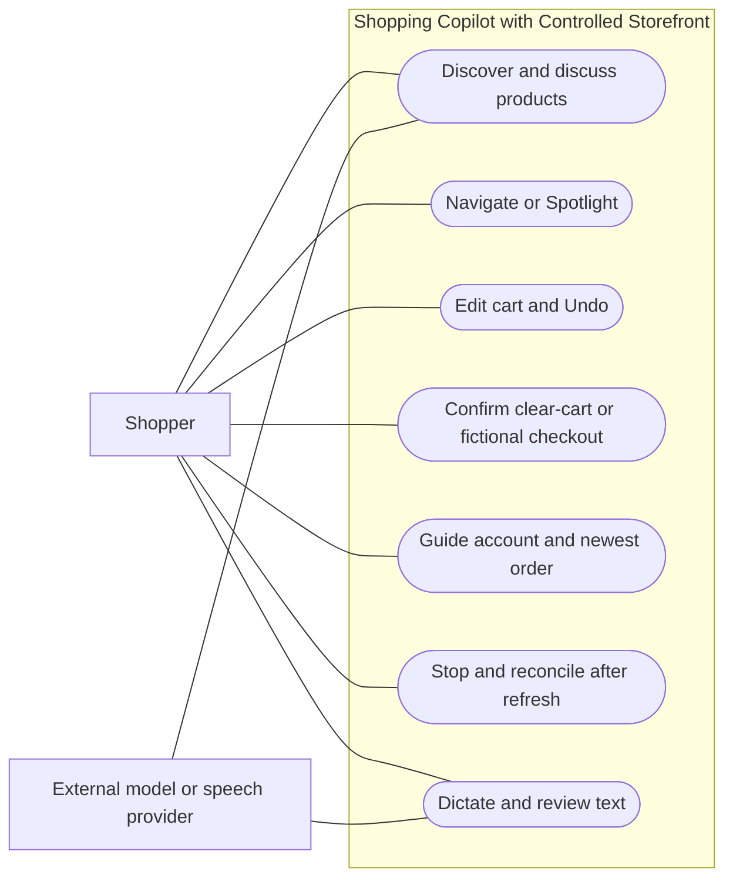
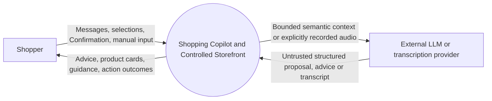
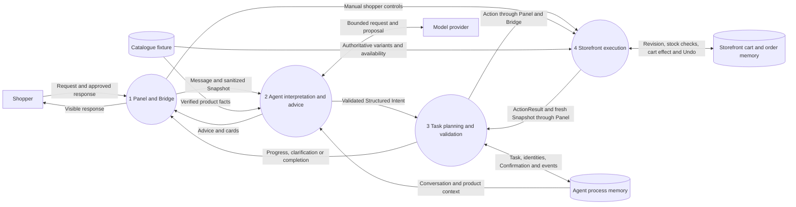
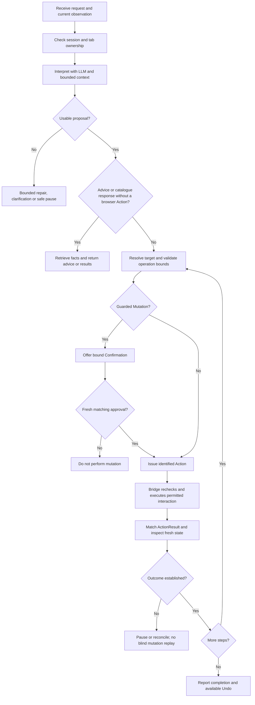
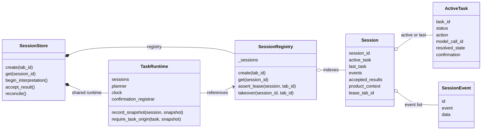
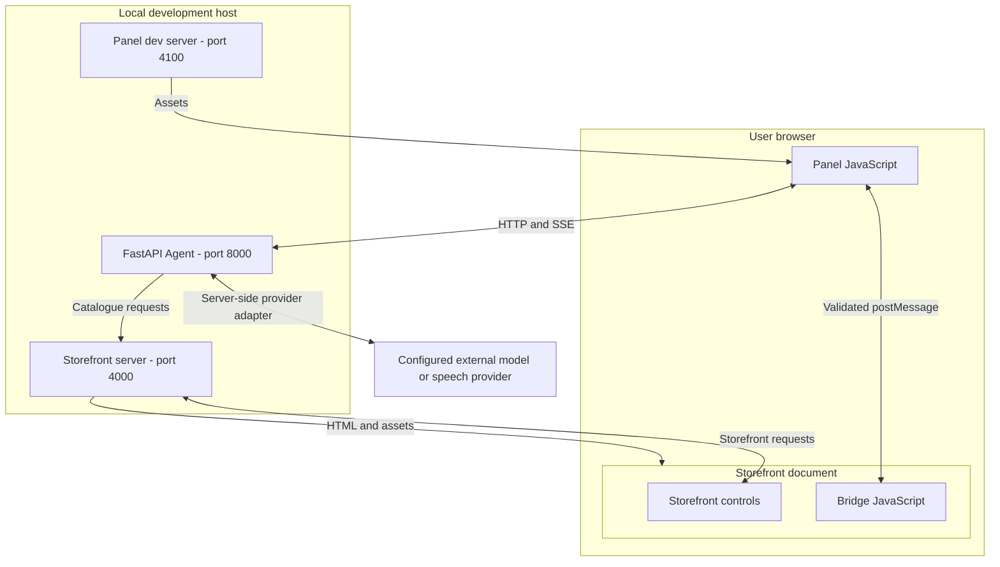

# Local-system design views

Updated: **2 October 2026**. Companion to [System Analysis & Design](system-analysis-design.md) and its existing sequence, state and conceptual entity diagrams. These views describe the current local implementation after the session refactor (`7df44d9`); they do not select AWS services or invent persistent storage. Diagrams simplify interfaces for explanation; code references identify the authoritative implementation.

## Use-case view



This diagram groups the nine detailed use cases in [section 3](system-analysis-design.md#3-use-cases). Model interpretation also supports action requests; provider links above highlight the conversational/speech interfaces, not an exhaustive invocation map. Sensitive login/payment entry remains a manual Storefront interaction.

## Data flow: context level



Manual Sensitive Field values stay within the Storefront interaction and are excluded from Agent/model context. Provider requests are made through server adapters; the provider does not control the browser.

## Data flow: detailed local processes



Data stores denote logical storage, not database services. The current Storefront cart is shared within its app instance; Agent session separation does not establish cart isolation. API delivery and browser execution are shown together only to keep the DFD readable; the sequence diagrams show the actual transport order.

## Activity: request to observed outcome



The flow is conceptual: Stop, tab takeover and stale-result rejection can interrupt progression. Clarification is interpreted with task context; it is not a hardcoded phrase branch. Detailed actual statuses remain in the main document's state diagram.

## Classes and module composition



Selected members only; this is not an exhaustive API listing. [SessionStore](../agent/sessions.py) explicitly calls functions in [interpretation](../agent/task_interpretation.py), [commands](../agent/task_commands.py), [results](../agent/task_results.py) and [recovery](../agent/task_recovery.py), passing [TaskRuntime](../agent/task_runtime.py). These are modules, not invented subclasses. [SessionRegistry](../agent/session_registry.py) handles lookup, 30-minute inactivity expiry and leases; [session_stream.py](../agent/session_stream.py) formats/delivers SSE. [Session records](../agent/session_state.py) hold the displayed state. No inheritance hierarchy or durable task-history store is implied.

## Physical storage and schema applicability

There is **no relational database in the local MVP**. The main design's ER view is conceptual. SQL tables, indexes, foreign-key constraints and normalization are therefore not implemented artifacts to submit as completed work.

| Implemented representation                    | Identity and relationships                                                              | Lifetime                                                                 |
| --------------------------------------------- | --------------------------------------------------------------------------------------- | ------------------------------------------------------------------------ |
| Python `SessionRegistry._sessions` dictionary | Session ID → Session; Session references active/last task and event/result collections. | Agent memory; inactivity expiry and process restart.                     |
| Accepted-result dictionary                    | `(task_id, action_id, sequence_number)` → accepted result.                              | Session memory; identity checks reject mismatched/stale results.         |
| Catalogue TypeScript fixtures                 | Product ID, variants, explicit facts and configured Money.                              | Versioned source; loaded by Storefront.                                  |
| GuardedCart instance                          | Product/size/colour line identity, revision, Undo and fictional order data.             | Storefront app-instance memory; not partitioned by Agent session.        |
| Panel browser storage                         | Session/tab restoration metadata.                                                       | Browser-local recovery aid; not authority to replay an uncertain Action. |

If CAP-04 chooses persistence, document its actual logical and physical schema then, including ownership, keys, retention and migration/restart behaviour. A diagram requirement does not authorize adding a database merely to populate the report.

## Local deployment and component placement



These are local development processes, not an AWS deployment. See the main design for the logical component view and CAP-04's unresolved HTTPS, access, isolation, restart and cost decisions.

## UI wireframes and implemented guidelines

Schematic desktop layout (not a screenshot; labels indicate regions rather than a fixed language direction):

```text
+--------------------------------+--------------------------------------+
| Copilot identity / Stop        |                                      |
| Status or recovery banner      |       Controlled Storefront           |
|--------------------------------|                                      |
| Independently scrolling chat   |       Product / cart / account        |
| Advice + product cards         |       controls in its iframe          |
| Clarification / Confirmation   |                                      |
|--------------------------------|                                      |
| Language + speech + text/send  |                                      |
+--------------------------------+--------------------------------------+
```

Guarded interaction detail:

```text
+------------------------------------------------+
| Proposed effect and affected cart state        |
| Shopper can inspect the bound request          |
| [Confirm]                 [Cancel / Stop]       |
+------------------------------------------------+
```

The schematic does not imply that a label alone grants authorization; IDs, state signatures, expiry and single-use checks bind Confirmation. Ordinary reversible edits show an Undo option with its original deadline.

The implementation uses Segoe UI/Tahoma/Arial, dark text, blue emphasis, light surfaces and clear borders. The Panel has bounded viewport height, independently scrolling messages and a composer outside that scroll region. RTL/localized labels, visible focus styles, disabled/pending states, responsive layout and a typing fallback support interaction. Inspect [Panel CSS](../panel/src/styles.css), [Panel markup/controller](../panel/src/panel.ts), [entry markup](../panel/index.html) and [Storefront CSS](../store/public/store.css) for exact layouts and tokens. This documents implemented design choices; it does not claim formal WCAG conformance or measured accessibility results. Final screenshots and export layout belong in the submission package after owner review.
